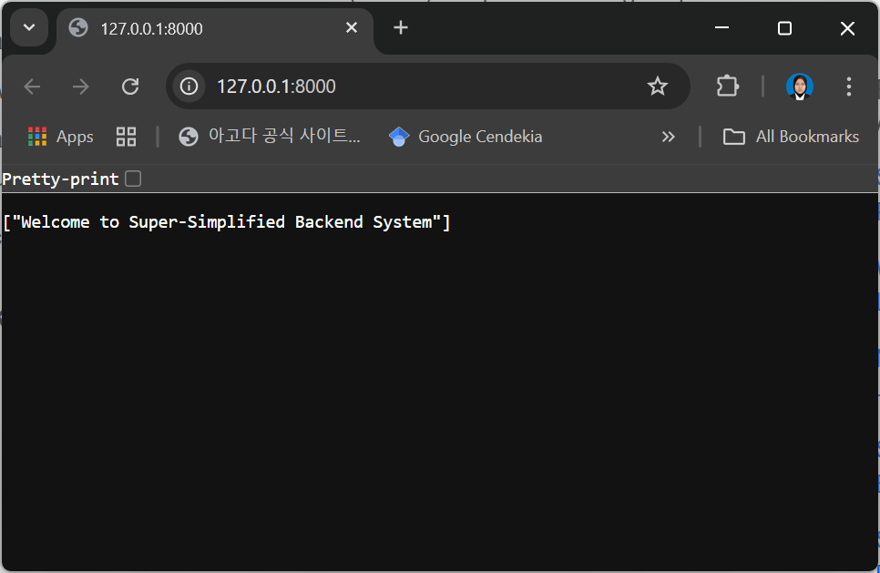
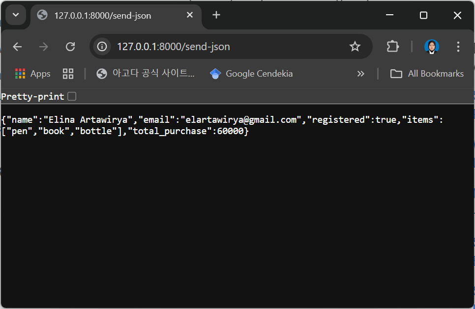
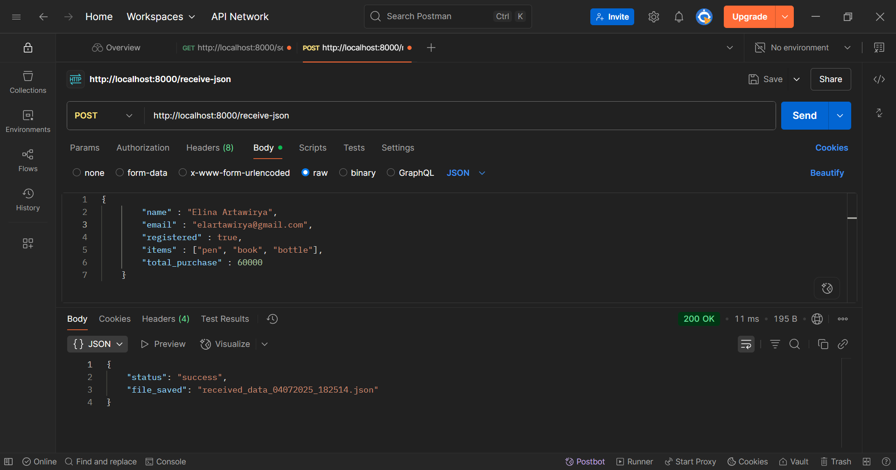
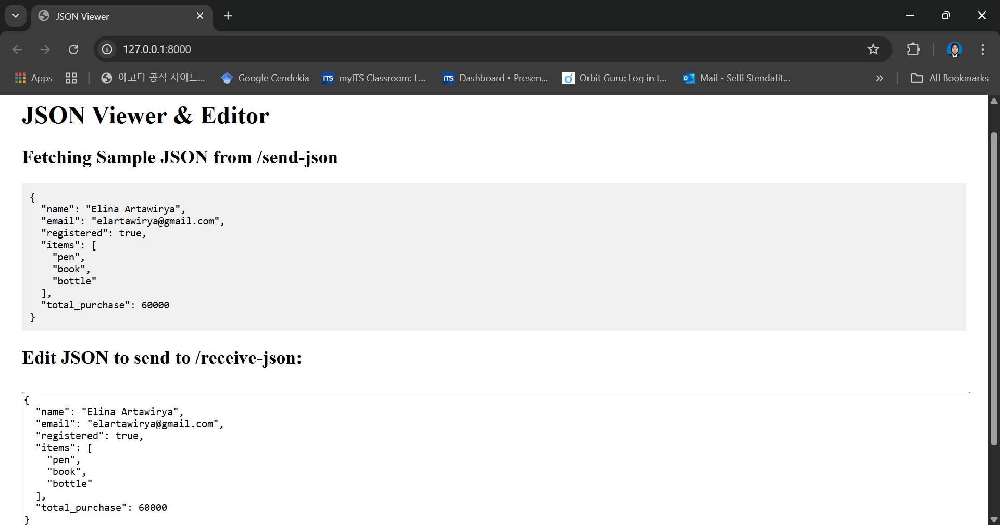
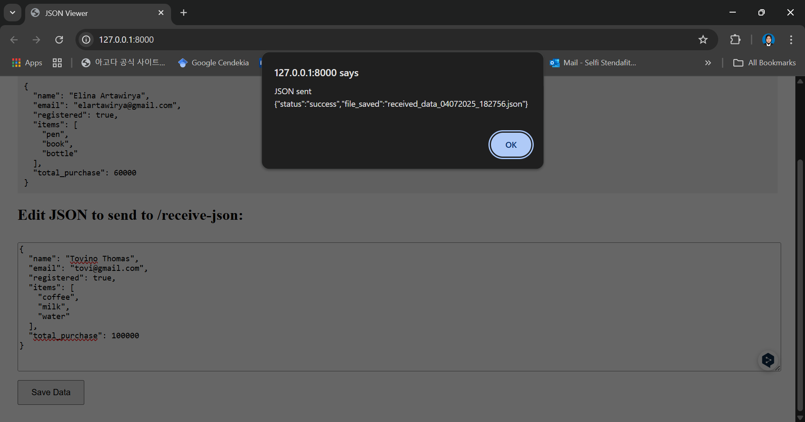

# Super-Simplified_Backend_System
## JSON Viewer and Editor

This system is used to send and receive JSON data using FastAPI and Uvicorn. In this system, there are two endpoints. When the program runs using uvicorn and go to http://localhost:8000/ at browser, we will get the welcome message as shown in the image below. 

After that, the system was tested for the endpoints that has been made. The first is to send JSON data. This test was conducted by opening http://localhost:8000/send-json at the browser and the result will be like in the image below. 

The last test to post JSON data and save it in to the data folder. We can send custom JSON data and will be saved in the data folder with datetime filename. This test was conducted in Postman application by doing command to POST http://localhost:8000/receive-json. The result is shown below. 

After making sure that the basic program runs, simple webpage was created. This webpage will show the JSON data that is being sent by the endpoint to the page. This webpage can also be used to modify the content of the JSON data that has been sent and later will be saved at the data folder. Other than that, the modified JSON data will be validated by using the Pydantic base model that has been made. The webpage will be like in the image below. 

And when the JSON data is validated and successfully saved, the message will be shown as the next image below. 

